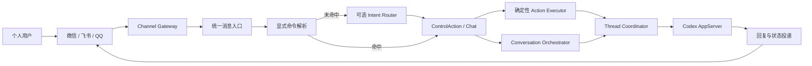
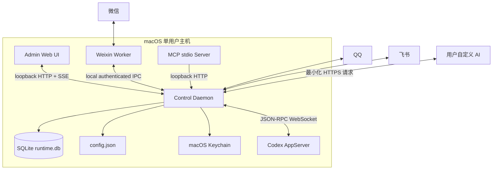

# qq-codex-bridge vNext 产品与技术架构

> 状态：目标架构基线（Target Architecture）  
> 日期：2026-08-10  
> 适用范围：macOS 优先的个人单实例产品，后续扩展 Windows  
> 兼容策略：不兼容 v0.x；不保留旧配置、旧命令、旧线程引用或旧 Provider 行为

---

## 1. 架构结论

vNext 不再被定义为“QQ 到 Codex 的转发脚本”，而是一个本地运行的 **个人 AI 通讯控制中枢**：

- 用户通过微信、飞书、QQ 等熟悉的 IM 与本机 Codex 对话；
- 每个 IM 聊天空间拥有独立、持久的 Codex 线程绑定；
- 不同 Codex 线程可以并行运行，同一线程严格串行；
- 可选的自定义 AI Router 把自然语言转换为受控操作，减少 `/` 指令依赖；
- 管理台负责安装引导、渠道连接、线程关系、智能路由、运行状态与故障恢复；
- 所有核心数据和密钥留在个人电脑，本产品不依赖自建云端控制面。

核心运行链路固定为：



架构上的强制选择：

1. Codex AppServer 是完整能力主链路；CDP 只作为受控故障恢复能力。
2. 不再支持 ChatGPT Desktop/Codex Desktop 双 Provider 概念。
3. 不再以 `.env` 作为产品配置源。
4. 不把配置正文存入 SQLite。
5. AI Router 不拥有执行权限，只产出严格结构化决策。
6. `spaceId` 表示一个 IM 聊天空间；`threadId` 表示一个 Codex 对话线程，二者通过显式 Binding 关联。
7. 新聊天空间默认新建独立线程，不自动绑定“最近线程”。
8. 默认不允许多个聊天空间静默共享同一个 Codex 线程。

---

## 2. 产品定义

### 2.1 产品使命

让用户无需依赖 Codex 官方远程连接、代理或复杂命令，即可从微信、飞书、QQ 稳定地控制本机 Codex，并在多个独立工作线程之间自然切换。

### 2.2 目标用户

首版只有一种用户角色：

- 拥有一台主要开发 Mac；
- 已安装 Codex；
- 希望在离开电脑时继续沟通、查看进度或下达控制指令；
- 使用个人微信、飞书或 QQ；
- 能接受首次在本机完成渠道授权和自定义 AI 配置。

不为以下角色设计：

- 企业多租户管理员；
- 多人共享同一 Codex 实例的团队；
- 需要云端账号体系和跨设备同步的用户；
- 把本产品作为通用 LLM 聚合客户端的用户。

### 2.3 产品形态

vNext 由四个用户可感知部分组成：

| 产品面 | 作用 |
|---|---|
| 本地后台服务 | 管理渠道、会话、Codex 线程、Router、队列和持久化 |
| 本地管理台 | 完成首次设置、绑定管理、诊断和日常控制 |
| IM 对话体验 | 普通聊天、自然语言控制、进度反馈、异常恢复 |
| Agent 推送能力 | 让 Codex/MCP/本地自动化向已登记 IM 目标主动推送 |

macOS 首版通过 `launchd` 以当前用户身份自启动，管理台只监听 loopback。微信网关由后台服务监督，不再要求用户手动启动多个命令。

### 2.4 非目标

vNext 首版明确不做：

- 云端控制面、账号注册、订阅计费；
- 公网直接暴露管理台；
- 企业 RBAC、审计合规和多人协作；
- 任意第三方 Agent Provider；
- 同一个 IM 聊天空间同时绑定多个 Codex 线程；
- 跨电脑同步运行状态；
- 让 AI Router 直接调用本机驱动或执行任意工具。

---

## 3. 产品原则

### 3.1 对话优先，命令兜底

用户应该能够说“切到支付重构那个线程”，而不是必须记住 `/tu 3`。显式命令继续存在，作为最快、最确定的高级入口，但不再是主要体验。

### 3.2 线程关系必须可见

任何时候用户都能知道：

- 当前在哪个 IM 聊天空间；
- 它绑定哪个 Codex 线程；
- 线程是否正在运行；
- 当前使用 AppServer 还是故障恢复传输；
- 下一条消息将发往哪里。

### 3.3 安全动作自动，高风险动作确认

查询类动作应立即完成；可能停止任务、改变全局模型或向第三方主动推送的动作必须确认。

### 3.4 失败必须可解释

禁止把“路由失败、线程繁忙、渠道离线、Codex 不可用”统一表现为无回复。每类失败都必须给出用户可执行的下一步。

### 3.5 本地优先

配置、线程映射、消息账本和密钥默认只保存在本机。只有启用自定义 Router 时，最小必要文本才发送给用户指定的模型服务。

### 3.6 不以兼容性牺牲结构

旧 `.env`、旧命令别名、旧 Provider、旧线程引用、旧 SQLite Schema 均不进入新核心。vNext 使用新的配置目录和数据库，一次性切换。

---

## 4. 核心产品模型

### 4.1 Channel Account

一个接入本产品的渠道身份，例如：

- 微信个人账号；
- 飞书应用；
- QQ Bot。

稳定标识格式：

```text
weixin:<accountId>
feishu:<accountId>
qq:<accountId>
```

### 4.2 Conversation Space

一个 IM 侧可持续对话的空间，可能是私聊或群聊。

```text
spaceId = <channelAccountId>::<scope>:<providerConversationId>
```

示例：

```text
weixin:personal::c2c:wxid_123
feishu:work::group:oc_xxx
qq:main::c2c:openid_xxx
```

`spaceId` 是全局稳定标识，不包含可变昵称。

### 4.3 Codex Thread

Codex AppServer 返回的真实线程。系统保存稳定 `threadId`，不再编码标题、窗口 ID 或 CDP Target ID 作为主线程引用。

### 4.4 Thread Binding

连接 Conversation Space 与 Codex Thread 的显式关系。

默认规则：

- 一个 Space 同时只能有一个 Active Binding；
- 一个 Thread 默认只能被一个 Space 独占绑定；
- 用户可以显式开启 Shared Binding，但系统必须持续展示共享警告；
- 删除 Binding 不删除 Codex Thread；
- 新 Space 第一次发送普通消息时，自动新建并绑定线程；
- 新线程默认名称为 `<渠道> · <联系人/群聊>`，用户可随后重命名。

### 4.5 Turn

一次向 Codex 提交并等待结果的完整运行。Turn 归属于 Thread，同时记录触发它的 Space 和 Message。

### 4.6 Control Action

产品允许执行的有限控制动作。首版固定为：

```ts
type ControlAction =
  | { type: "thread.list" }
  | { type: "thread.current" }
  | { type: "thread.switch"; target: ThreadSelector }
  | { type: "thread.create"; title?: string }
  | { type: "thread.rename"; title: string }
  | { type: "thread.fork"; title?: string }
  | { type: "turn.status" }
  | { type: "turn.interrupt" }
  | { type: "model.current" }
  | { type: "model.switch"; model: string }
  | { type: "quota.read" }
  | { type: "push.targets" }
  | { type: "push.send"; target: string; content: string }
  | { type: "system.status" }
  | { type: "help" };
```

任何未列入联合类型的动作都不能执行。

---

## 5. 主要用户旅程

### 5.1 首次安装与设置

用户目标：在十分钟内完成至少一个优先渠道到 Codex 的闭环。

步骤：

1. 安装后台服务并注册 `launchd`；
2. 自动打开本地管理台；
3. 管理台检查 Codex AppServer、文件权限和本地端口；
4. 用户选择微信或飞书作为首个渠道；
5. 微信展示二维码并反馈登录状态；飞书展示凭据和权限检查；
6. 管理台要求用户从该渠道发送一条测试消息；
7. 系统创建 Conversation Space、Codex Thread 和 Binding；
8. 测试回复成功后进入完成页；
9. 智能调度默认关闭，用户可以随后配置自定义 AI 并启用 `assist`。

完成标准：管理台必须同时证明“渠道入站、Codex 提交、Codex 回复、渠道出站”四段均成功。

### 5.2 普通对话

1. 用户在某个 IM Space 发送消息；
2. 渠道立即确认消息已被系统接收；
3. 系统找到或创建独立线程 Binding；
4. 同一线程已有 Turn 时，新消息进入该线程队列；
5. Codex 开始运行；
6. 超过两秒仍未完成时，发送轻量状态提示；
7. 最终文本和媒体回到原 Space；
8. 状态消息被更新或自然收束，不重复发送最终内容。

### 5.3 自然语言控制

示例：“切到昨天那个发布线程”。

1. 显式命令解析器未命中；
2. Intent Router 判断为 `thread.switch`；
3. 服务端根据最近线程列表解析候选；
4. 唯一候选且置信度足够时直接切换；
5. 多候选时返回编号选择；
6. 执行成功后回复“已切换到……，下一条消息会发送到该线程”。

### 5.4 多渠道并行

```text
QQ Space A    → Thread A → Turn A
微信 Space B  → Thread B → Turn B
飞书 Space C  → Thread C → Turn C
```

三个线程通过 AppServer 并行。每个线程内部保持 FIFO，不允许同一线程出现两个并行的活动 Turn。

### 5.5 故障恢复

当 AppServer 不可用时：

1. 健康状态切换为 `degraded`；
2. 新消息默认进入短暂等待队列；
3. 仅在消息尚未提交时，允许受控切换到 CDP Recovery；
4. CDP 模式全局串行并在 IM/管理台明确标记；
5. 已确认提交的消息绝不跨传输自动重发；
6. AppServer 恢复后只影响下一轮，不迁移正在进行的 Turn。

---

## 6. 管理台产品架构

### 6.1 信息架构

管理台固定为六个一级页面：

| 页面 | 回答的问题 | 核心操作 |
|---|---|---|
| 首页 | 系统现在能不能用 | 查看健康、快速修复、重启受影响组件 |
| 渠道 | 微信/飞书/QQ 是否在线 | 添加账号、授权、测试、停用 |
| 对话空间 | 每个聊天绑定哪个线程 | 绑定、新建、重绑、解除、查看消息 |
| 任务 | 哪些 Turn 正在运行或排队 | 查看进度、停止、重试 |
| 智能调度 | AI Router 如何判断和执行 | 配置模型、模式、测试、查看决策记录 |
| 设置与诊断 | 配置、日志、数据与版本 | 保存应用、导出诊断、数据清理 |

主动推送作为“渠道”下的二级能力，不再独立占据首要导航。推送目标从已验证 Conversation Space 创建。

### 6.2 首页状态模型

首页不展示原始 JSON 作为主要内容，而展示四个可执行状态：

```text
Ready       全部关键链路正常
Degraded    可继续使用，但存在降级或部分渠道故障
Action      需要用户完成扫码、授权或确认
Offline     Codex 或后台服务不可用
```

每个异常卡片必须包含：影响范围、发生时间、当前重试状态和一个主操作。

### 6.3 对话空间页

每一行展示：

- 渠道与聊天名称；
- 当前线程名称；
- 独占/共享状态；
- 当前 Turn 状态；
- 最近消息时间；
- 传输状态；
- 最近错误。

主操作固定为：查看、切换线程、新建线程、解除绑定。原始 `spaceId`、`threadId` 收入详情区。

### 6.4 智能调度页

提供：

- `off / assist / auto` 模式；
- OpenAI-compatible Endpoint、Model 和 Secret；
- “测试连接”；
- 十条内置自然语言测试用例；
- 最近 Router 决策；
- 置信度、候选动作、是否确认、耗时和降级原因；
- 数据发送范围说明。

### 6.5 配置交互

管理台按钮使用“保存并应用”，而不是“保存草稿”。提交后返回 Apply Plan：

```ts
type ApplyPlan = {
  revision: string;
  effects: Array<
    | { type: "hot_reload"; component: string }
    | { type: "component_restart"; component: string }
    | { type: "daemon_restart" }
  >;
};
```

管理台展示执行进度，直到新 revision 成为 Active。不能在配置实际上未生效时显示成功。

### 6.6 可访问性基线

- 所有交互元素必须是原生按钮、链接或表单控件；
- 动态状态使用 `aria-live`；
- 不以颜色作为唯一状态区分；
- 所有页面可以仅用键盘完成核心操作；
- 焦点在弹窗、确认和错误返回后保持可预测；
- 缩放到 200% 时核心操作仍可完成；
- Secret 默认遮蔽，用户主动操作后才短暂显示。

---

## 7. 智能调度架构

### 7.1 职责边界

Intent Router 只负责：

- 判断消息是普通聊天还是控制意图；
- 选择允许的 `ControlAction.type`；
- 抽取标题、模型名、目标别名等自然语言参数；
- 给出置信度和是否需要澄清。

Intent Router 不负责：

- 访问 SQLite；
- 查询真实线程 ID；
- 调用 Codex、渠道或 Push API；
- 判断最终授权；
- 拼接任意 Shell、URL 或驱动命令。

### 7.2 Port

```ts
interface IntentRouterPort {
  route(input: IntentRouterInput): Promise<RoutingDecision>;
  health(): Promise<RouterHealth>;
}

type RoutingDecision = {
  kind: "chat" | "control" | "clarify";
  action?: ControlActionCandidate;
  confidence: number;
  clarification?: string;
  providerRequestId?: string;
};
```

首个 Adapter 为 OpenAI-compatible JSON Schema 接口。实现使用受超时和输出大小限制的 HTTP Client，返回值必须经 Zod 验证。

### 7.3 Router 输入

允许发送：

- 当前用户消息；
- 当前渠道和 Space 的展示名称；
- 当前绑定线程的标题；
- 最多十条候选线程的标题、项目和相对时间；
- 最近最多三条控制相关消息；
- 允许动作清单和风险说明。

禁止发送：

- API Key、Token、Secret；
- 本地文件内容；
- 完整 Codex 历史；
- 原始渠道用户 ID；
- 与当前意图无关的其他 Space 消息。

### 7.4 模式

| 模式 | 行为 |
|---|---|
| `off` | 不调用 Router，只有显式命令和普通聊天 |
| `assist` | 控制意图经 Router 识别，变更类动作由用户确认 |
| `auto` | 高置信度低风险动作自动执行，高风险动作仍确认 |

默认值为 `off`；连接测试成功后，产品推荐用户启用 `assist`。

### 7.5 风险矩阵

| 动作 | 风险 | `assist` | `auto` |
|---|---|---|---|
| 状态、额度、线程列表 | 低 | 自动 | 自动 |
| 唯一匹配线程切换 | 中 | 确认 | 自动 |
| 新建、重命名、分叉线程 | 中 | 确认 | 自动 |
| 中断当前 Turn | 高 | 确认 | 确认 |
| 切换全局模型 | 高 | 确认 | 确认 |
| 主动推送 | 高 | 确认并展示目标与正文 | 确认并展示目标与正文 |
| 共享线程绑定 | 高 | 确认 | 确认 |

### 7.6 置信度与失败策略

- `confidence >= 0.90`：进入风险矩阵；
- `0.65 <= confidence < 0.90`：澄清或展示候选；
- `< 0.65`：不执行控制动作；
- Router 总超时：1500ms；
- 连续三次网络错误：熔断 60 秒；
- 熔断期间显式命令和普通聊天不受影响；
- 看起来像控制请求但无法确定时，不能静默当作普通聊天发送给 Codex。

### 7.7 决策审计

保存：

- Space；
- 输入摘要或不可逆 Hash；
- Router Adapter、Model；
- 决策和置信度；
- 是否确认；
- 最终执行结果；
- 延迟和失败原因。

默认不永久保存发送给 Router 的完整文本；诊断模式下可由用户临时开启七天明文记录。

---

## 8. 线程与并发架构

### 8.1 Thread Coordinator

所有 Chat 和 Control Action 在访问 Codex 前必须经过 `ThreadCoordinator`。

```ts
interface ThreadCoordinator {
  resolveBinding(spaceId: string): Promise<ThreadBinding>;
  createAndBind(spaceId: string, title?: string): Promise<ThreadBinding>;
  bind(spaceId: string, threadId: string, mode: "exclusive" | "shared"): Promise<ThreadBinding>;
  enqueueTurn(input: StartTurnInput): Promise<TurnHandle>;
  interrupt(threadId: string, turnId: string): Promise<void>;
}
```

### 8.2 并发不变量

1. 同一 `spaceId` 的入站消息按接收序号串行处理；
2. 同一 `threadId` 同时最多一个 Active Turn；
3. 不同 `threadId` 可以并行；
4. AppServer 的 Pending Turn 以 `threadId + turnId` 唯一索引；
5. CDP Recovery 启用时，全实例并发数降为 1；
6. 渠道回复必须按原始 `spaceId` 路由，不能依赖“当前桌面线程”；
7. Turn 已被 AppServer 接受后，任何错误都不能触发自动跨传输重发。

### 8.3 默认绑定策略

首次普通消息：

```text
不存在 Binding
  → 创建 Codex Thread
  → 设置易读标题
  → 写入 Binding
  → 提交消息
```

首次控制消息不会隐式创建线程，例如“查看状态”只返回系统状态。

### 8.4 同线程共享

共享 Binding 是高级能力：

- 默认关闭；
- 只能从管理台或带确认的 Control Action 开启；
- 多个 Space 仍复用同一个线程级队列；
- 每条提交给 Codex 的消息附带渠道来源标签；
- 管理台和 IM 回复持续显示“共享线程”标记。

---

## 9. 技术架构

### 9.1 运行时组件



### 9.2 进程边界

| 进程 | 原因 |
|---|---|
| `control-daemon` | 唯一业务核心、配置与数据库拥有者 |
| `weixin-worker` | 微信登录态和协议故障不能拖垮核心服务 |
| `mcp-server` | stdio 生命周期由 Codex/调用方控制 |

QQ、飞书 Adapter 默认运行在 Daemon 内。只有实际稳定性证明需要时才拆出独立 Worker。

### 9.3 目标目录

```text
apps/
  control-daemon/          # Composition Root、HTTP、生命周期
  admin-ui/                # 独立前端资源，可由 daemon 静态托管
  weixin-worker/           # 微信授权和协议进程
  mcp-server/              # 主动推送 MCP

packages/
  domain/                  # 纯领域类型、不变量、状态机
  application/             # Use Cases、Orchestrators、Action Executor
  ports/                   # Channel、Codex、Router、Store、Config、Secret
  store-sqlite/            # 运行数据存储
  config/                  # Schema、Revision、Apply Planner
  channel-qq/
  channel-weixin/
  channel-feishu/
  codex-appserver/
  codex-cdp-recovery/
  intent-openai-compatible/
  push/
  observability/

tests/
  unit/
  contract/
  integration/
  e2e/
```

### 9.4 依赖方向

```text
apps
  → application
    → domain
    → ports

adapters / store / config
  → ports
  → domain
```

禁止：

- Store 引用 App 层的配置类型；
- Domain 引用渠道 SDK；
- Router Adapter 直接引用 Desktop Driver；
- Admin Route 直接执行 SQL；
- Channel Adapter 直接决定线程绑定；
- Composition Root 内联完整业务流程。

### 9.5 Application Use Cases

核心 Use Case 固定为：

```text
ReceiveInboundMessage
RouteUserIntent
ExecuteControlAction
StartConversationTurn
DeliverTurnProgress
CompleteConversationTurn
BindConversationSpace
ManageChannelAccount
ApplyConfiguration
RunHealthCheck
EnqueuePush
DeliverPush
```

每个 Use Case 通过 Port 访问外部系统，不直接实例化 Adapter。

---

## 10. 配置与密钥架构

### 10.1 唯一配置源

产品配置文件：

```text
~/.qq-codex-bridge/config.json
```

只保存非敏感配置和 Secret Reference：

```json
{
  "version": 1,
  "runtime": {
    "listenHost": "127.0.0.1",
    "listenPort": 3100,
    "maxParallelThreads": 3
  },
  "codex": {
    "transport": "app-server",
    "recoveryTransport": "cdp"
  },
  "router": {
    "mode": "assist",
    "adapter": "openai-compatible",
    "baseUrl": "https://example.com/v1",
    "model": "router-model",
    "secretRef": "router/default"
  },
  "channels": []
}
```

生产产品不读取 `.env`。测试和本地开发可以使用测试专用注入机制，但不进入用户配置语义。

### 10.2 Secret Store

```ts
interface SecretStorePort {
  get(ref: string): Promise<string | null>;
  set(ref: string, value: string): Promise<void>;
  delete(ref: string): Promise<void>;
}
```

macOS 使用 Keychain；Windows 后续使用 Credential Manager。SQLite、配置文件、日志和 API 响应中都不能出现真实 Secret。

### 10.3 配置 Revision

保存流程：

1. 管理台提交完整候选配置和 Secret 变更；
2. 服务端解析并执行 Zod 校验；
3. 执行跨字段和端口冲突检查；
4. 将 Secret 先写入 Secret Store；
5. 配置写入临时文件、`fsync`、原子重命名；
6. 生成内容 Hash 作为 revision；
7. `ApplyPlanner` 计算受影响组件；
8. 热更新或重启受影响组件；
9. 健康检查通过后将 revision 标记为 Active；
10. 失败则回滚上一 revision 和 Secret Reference。

### 10.4 配置分类

| 配置 | 应用方式 |
|---|---|
| Router 模式、阈值 | 热更新 |
| Push 限流、进度提示 | 热更新 |
| 渠道凭据、账号开关 | 重启对应 Channel Component |
| 监听端口、数据库路径 | 重启 Daemon |
| Codex Transport | 等待活动 Turn 完成后切换 |

---

## 11. 数据架构

### 11.1 存储职责

SQLite 只存运行数据：

- Conversation Space；
- Thread Binding；
- 消息账本；
- Turn 与事件；
- Router 决策；
- Control Action 执行；
- 渠道投递；
- Push 目标与任务；
- 健康事件和配置 revision 元数据。

### 11.2 核心表

#### `conversation_spaces`

| 字段 | 说明 |
|---|---|
| `space_id` PK | 稳定聊天空间 ID |
| `channel` | `weixin/feishu/qq` |
| `account_id` | 渠道账号 |
| `provider_conversation_id` | 渠道会话 ID |
| `scope` | `c2c/group` |
| `display_name` | 可变展示名 |
| `status` | `active/paused/unavailable` |
| `last_inbound_at` | 最近入站 |
| `last_outbound_at` | 最近出站 |

#### `thread_bindings`

| 字段 | 说明 |
|---|---|
| `binding_id` PK | UUID |
| `space_id` | Conversation Space |
| `thread_id` | Codex Thread ID |
| `thread_title` | 缓存展示名 |
| `mode` | `exclusive/shared` |
| `status` | `active/detached/broken` |
| `created_at` | 创建时间 |
| `updated_at` | 更新时间 |

约束：每个 `space_id` 只能有一条 Active Binding；`exclusive` 的 `thread_id` 只能有一条 Active Binding。

#### `messages`

| 字段 | 说明 |
|---|---|
| `message_id` PK | 内部 UUID |
| `provider_message_id` | 渠道消息 ID |
| `space_id` | 来源/目标 Space |
| `direction` | `inbound/outbound/system` |
| `content_json` | 统一内容结构 |
| `dedupe_key` | 去重键 |
| `status` | 接收或投递状态 |
| `created_at` | 时间 |

#### `turns`

| 字段 | 说明 |
|---|---|
| `turn_id` PK | Codex Turn ID 或本地 Pending ID |
| `thread_id` | Codex Thread |
| `space_id` | 发起 Space |
| `inbound_message_id` | 原始消息 |
| `status` | `queued/starting/running/completed/failed/interrupted` |
| `transport` | `app-server/cdp-recovery` |
| `error_code` | 稳定错误码 |
| `started_at/completed_at` | 生命周期 |

#### `router_decisions`

| 字段 | 说明 |
|---|---|
| `decision_id` PK | UUID |
| `space_id` | 来源 Space |
| `message_id` | 输入消息 |
| `kind` | `chat/control/clarify` |
| `action_json` | 结构化候选动作 |
| `confidence` | 置信度 |
| `confirmation_status` | 确认状态 |
| `latency_ms` | 路由耗时 |
| `result` | 执行结果 |

#### `deliveries`

记录每次渠道发送尝试、幂等键、状态、Provider Message ID、重试次数和稳定错误码。

#### `push_targets` / `push_jobs`

保留 Alias、幂等、队列、重试和媒体沙箱能力，但所有目标必须由已验证 Space 创建。

### 11.3 数据保留

默认策略：

- 消息正文：90 天；
- Router 明文诊断：默认关闭，开启后 7 天；
- Runtime Event：30 天；
- Delivery、Turn、Decision 元数据：180 天；
- Thread Binding：永久保留，直到用户删除；
- 媒体缓存：7 天或空间超过阈值时按 LRU 清理。

用户可以一键清除消息内容但保留 Binding。

---

## 12. 消息与媒体契约

### 12.1 统一消息

```ts
type MessageContent = {
  text: string;
  mentions: Mention[];
  attachments: Attachment[];
};

type Attachment = {
  id: string;
  kind: "image" | "audio" | "video" | "file";
  localPath: string;
  mimeType: string;
  size: number;
  name?: string;
  transcript?: string;
};
```

渠道 Adapter 只负责 Provider Payload 与统一结构之间转换，不负责拼接给 Codex 的 Prompt。

### 12.2 渠道优先级

| 能力 | 微信 | 飞书 | QQ |
|---|---:|---:|---:|
| 文本入站/出站 | P0 | P0 | P1 |
| 图片入站/出站 | P0 | P0 | P1 |
| 文件入站/出站 | P0 | P0 | P1 |
| 语音入站转写 | P0 | P1 | P1 |
| 主动推送 | P0 | P0 | 账号能力允许时再启用 |
| 富文本 | 以可靠呈现为准 | P1 | P2 |

### 12.3 去重和幂等

- 入站使用 `channel + account + providerMessageId` 唯一约束；
- Provider 无稳定 Message ID 时使用短窗口内容指纹；
- 出站 Delivery 使用稳定 `deliveryKey`；
- Push 必须使用调用方提供或服务端可重建的幂等键；
- 重启后仍能判断是否已提交和已投递。

---

## 13. API 与内部 Port

### 13.1 管理 API

统一前缀：`/api/v1`。

```text
GET    /health
GET    /system/status

GET    /channels
POST   /channels
POST   /channels/:id/test
POST   /channels/:id/restart
DELETE /channels/:id

GET    /spaces
GET    /spaces/:id
GET    /spaces/:id/messages
POST   /spaces/:id/bindings
DELETE /spaces/:id/bindings/current

GET    /threads
POST   /threads
PATCH  /threads/:id

GET    /turns
POST   /turns/:id/interrupt

GET    /router/config
PUT    /router/config
POST   /router/test
GET    /router/decisions

GET    /config
POST   /config/plan
POST   /config/apply

GET    /diagnostics/events
POST   /diagnostics/export
```

管理台使用 SSE 订阅状态：

```text
GET /api/v1/events
```

事件包括渠道状态、Turn 状态、配置应用进度、Router 熔断和传输切换。

### 13.2 Channel Port

```ts
interface ChannelPort {
  start(): Promise<void>;
  stop(): Promise<void>;
  health(): Promise<ChannelHealth>;
  onMessage(handler: (message: InboundEnvelope) => Promise<void>): void;
  deliver(input: DeliveryRequest): Promise<DeliveryResult>;
}
```

### 13.3 Codex Port

```ts
interface CodexPort {
  health(): Promise<CodexHealth>;
  listThreads(input: ListThreadsInput): Promise<CodexThread[]>;
  createThread(input: CreateThreadInput): Promise<CodexThread>;
  renameThread(threadId: string, title: string): Promise<void>;
  forkThread(threadId: string): Promise<CodexThread>;
  startTurn(input: StartCodexTurnInput): Promise<CodexTurnHandle>;
  interruptTurn(threadId: string, turnId: string): Promise<void>;
  getControlState(): Promise<CodexControlState>;
  switchModel(model: string): Promise<CodexControlState>;
}
```

Port 只使用真实 `threadId` 和 `turnId`，不泄露 AppServer JSON-RPC 格式。

### 13.4 Store Port

Store Port 按聚合拆分：

```text
ConversationSpaceRepository
ThreadBindingRepository
MessageLedger
TurnRepository
RoutingDecisionRepository
DeliveryRepository
PushRepository
RuntimeEventRepository
```

禁止创建一个覆盖全部表的 `DatabaseService`。

---

## 14. Codex Transport

### 14.1 AppServer 主链路

AppServer Adapter 负责：

- 发现或启动受管 AppServer；
- 建立 JSON-RPC WebSocket；
- 请求/响应关联；
- Thread 和 Turn 生命周期；
- 增量内容与最终内容归一化；
- 媒体引用收集；
- 健康检查和自动重连。

所有 Pending Request 和 Pending Turn 必须在连接关闭时显式失败，不能悬挂到超时。

### 14.2 CDP Recovery

CDP 不再伪装成与 AppServer 完全等价的主驱动，只实现恢复所需的最小能力：

- 选择已知线程；
- 提交文本；
- 等待并采集最终回复；
- 查询基本控制状态。

不保证：

- 多线程并发；
- 完整线程创建、分叉、重命名；
- 精确 Turn Event；
- 与 AppServer 相同的媒体能力。

进入 CDP Recovery 前必须向上层报告 Capability Set，Action Executor 禁止执行不受支持动作。

### 14.3 Transport 状态机

```text
probing
  → appserver_ready
  → appserver_reconnecting
  → degraded_waiting
  → cdp_recovery
  → appserver_ready
  → unavailable
```

状态变化写入 Runtime Event 并通过 SSE 和 IM 状态查询公开。

---

## 15. 安全架构

### 15.1 本地边界

- 管理 API 默认只绑定 `127.0.0.1`；
- 首次启动生成本地管理 Session Secret；
- 所有修改请求要求 CSRF Token；
- 不允许通过配置把管理台直接暴露到公网；
- MCP 和 Worker IPC 使用独立 Token；
- Push API 默认仅 loopback。

### 15.2 渠道授权

- 每个 Channel Account 显式启用；
- 支持允许的联系人/群聊白名单；
- 群聊默认要求 @机器人或触发前缀；
- 线程管理、停止任务、模型切换默认只允许 Owner Space；
- 收到未知 Space 第一条消息时，可配置为拒绝或进入待批准列表。

### 15.3 自定义 Router

- Base URL 必须通过 URL 校验；
- 默认要求 HTTPS，loopback 可允许 HTTP；
- 禁止自动跟随跨域重定向携带 Authorization；
- API Key 只从 Secret Store 读取；
- 请求日志不包含 Authorization 和完整正文；
- 设置页明确展示会发送哪些数据。

### 15.4 媒体安全

- 所有下载文件进入受管媒体目录；
- 校验大小、MIME 和扩展名；
- 禁止路径穿越和符号链接逃逸；
- 主动推送只能使用允许的 Outbox Root；
- 管理台媒体预览只能读取消息账本已登记文件；
- 超过保留期自动清理。

### 15.5 日志脱敏

统一 Redaction 覆盖：

```text
token, secret, password, authorization, apiKey,
clientSecret, accessKey, openId, unionId, webhook signature
```

稳定错误码与面向用户的消息分离，内部堆栈只进入本地诊断包。

---

## 16. 可观测性与错误模型

### 16.1 统一健康模型

```ts
type ComponentHealth = {
  component: string;
  status: "ready" | "degraded" | "action_required" | "offline";
  code?: string;
  message: string;
  since: string;
  lastSuccessAt?: string;
  suggestedAction?: string;
};
```

组件包括：Daemon、Database、Codex AppServer、CDP Recovery、每个 Channel Account、Router、Weixin Worker、Push Worker。

### 16.2 稳定错误码

错误码按边界分类：

```text
CHANNEL_AUTH_REQUIRED
CHANNEL_RATE_LIMITED
CHANNEL_DELIVERY_FAILED
CODEX_UNAVAILABLE
CODEX_THREAD_NOT_FOUND
CODEX_TURN_BUSY
CODEX_TURN_TIMEOUT
ROUTER_UNAVAILABLE
ROUTER_INVALID_OUTPUT
ROUTER_AMBIGUOUS
BINDING_CONFLICT
CONFIG_INVALID
CONFIG_APPLY_FAILED
MEDIA_REJECTED
```

每个错误码固定映射：是否可重试、是否需要用户动作、是否影响其他渠道、推荐操作。

### 16.3 诊断包

用户可以生成本地 Zip，包含：

- 脱敏配置；
- 组件版本；
- 最近健康事件；
- 最近失败的 Turn、Delivery 和 Router 元数据；
- AppServer 连接摘要；
- 数据库 Schema 版本；
- 不包含消息正文、密钥和媒体文件。

---

## 17. 性能与韧性目标

### 17.1 SLO

| 指标 | 目标 |
|---|---|
| 入站消息被确认 P95 | < 500ms |
| Intent Router P95 | < 1200ms |
| 低风险 Control Action P95 | < 2s |
| AppServer Turn 启动 P95 | < 2s，不含模型生成 |
| 不同线程并行数 | 默认 3，可配置 1～5 |
| 配置应用结果反馈 | < 10s，需重启 Daemon 时 < 30s |
| Daemon 意外退出恢复 | < 15s |
| 管理台首页可交互 | < 2s，本地环境 |

### 17.2 背压

- Space 入站队列上限默认 20；
- Thread 队列上限默认 10；
- 全局活动 Turn 默认 3；
- 超限时明确回复“已排队/队列已满”，不能静默丢弃；
- Push Worker 与 Conversation Turn 使用独立并发和限流；
- Router 熔断不影响显式命令和 Chat。

### 17.3 SQLite

- 启用 WAL；
- 所有状态迁移使用短事务；
- 大媒体不写入数据库；
- 管理台消息使用游标分页；
- 消息清理和媒体清理在低优先级 Worker 中执行；
- 同一进程只有 Store Adapter 持有写连接。

### 17.4 恢复

Daemon 启动时：

1. 检查上次 Active Config Revision；
2. 迁移新数据库 Schema；
3. 把遗留 `starting/running` Turn 标记为 `unknown` 并向 AppServer 对账；
4. 恢复 Push 队列；
5. 启动渠道；
6. 执行端到端健康检查；
7. 发布 Ready/Degraded 状态。

---

## 18. 测试架构

### 18.1 测试层级

| 层级 | 验证内容 |
|---|---|
| Unit | 状态机、解析、校验、风险矩阵、去重、Apply Planner |
| Contract | 每个 Channel、Codex、Router、Store Port 的实现契约 |
| Integration | Daemon + SQLite + Fake AppServer + Fake Channel |
| E2E | 微信/飞书沙箱或测试账号的真实收发闭环 |
| Product Flow | 首次设置、绑定、自然控制、恢复、配置应用 |

### 18.2 必须覆盖的关键场景

1. QQ、微信、飞书分别绑定 A、B、C 三个线程并行对话；
2. 两个 Space 误绑同一 Exclusive Thread 时被拒绝；
3. 同一线程两条消息严格串行；
4. AppServer 在提交前失败时允许 CDP Recovery；
5. AppServer 在提交后断线时不重复提交；
6. Router 输出非法 Schema 时绝不执行动作；
7. Router 把普通聊天误判为高风险动作时仍需确认；
8. 配置应用失败后 Active Revision 不变化；
9. Daemon 重启后 Binding、队列、消息幂等保持正确；
10. 微信或飞书单渠道故障不影响另一渠道。

### 18.3 Fake AppServer 规范

Fake WebSocket 必须复现真实生命周期：监听器注册后异步触发 `open`，支持连接关闭、乱序通知、重复通知、超时和 Turn 中断。禁止依赖同步 `open` 的测试桩。

---

## 19. macOS 部署架构

### 19.1 文件布局

```text
~/.qq-codex-bridge/
  config.json
  runtime.db
  logs/
  media/
  diagnostics/
  run/
```

密钥不出现在该目录，全部进入 Keychain。

### 19.2 launchd

- 以 `LaunchAgent` 安装，不使用 root；
- 登录后自动启动；
- 崩溃后按退避策略重启；
- stdout/stderr 进入受管日志；
- 管理台通过受控 API 请求优雅重启，不直接执行任意 Shell；
- 卸载时由用户选择是否保留配置和数据。

### 19.3 安装体验

首版可以使用签名安装脚本或包管理方式，但产品目标是：

```text
安装 → 自动启动 → 自动打开管理台 → 完成引导
```

用户不应手动运行 Bridge、微信网关和 MCP 三个常驻命令。

### 19.4 Windows 预留边界

只预留以下 Port，不在 macOS 首版实现 Windows：

- `ServiceManagerPort`：launchd / Windows Service；
- `SecretStorePort`：Keychain / Credential Manager；
- `PathProviderPort`：用户数据目录；
- `ProcessDiscoveryPort`：Codex 进程和 AppServer 发现。

业务模型、数据库和管理台保持一致。

---

## 20. 不兼容清理清单

vNext 开始实现时直接删除或替换：

- `chatgpt-desktop` Provider 和会话注册表；
- `/cgpt`、`/source` 及相关兼容命令；
- `conversationProvider` 配置和数据库字段；
- `.env` 产品配置加载；
- SQLite 中的管理台配置 draft；
- 编码标题、项目、Page Target 的旧线程引用；
- 新 Session 自动绑定当前/最新桌面线程的行为；
- Composition Root 中内联的 Conversation Provider；
- 管理台“保存后重启生效但启动不读取”的伪闭环；
- 以原始 JSON 为主要配置入口的交互；
- CDP 与 AppServer 完全等价的抽象假设。

建议使用新的数据库文件 `runtime-vnext.db`，不迁移 v0.x Session 和 Message 数据。

---

## 21. 实施阶段

### Phase 0：新核心骨架

目标：建立不可变边界，不接真实渠道。

- 新 Domain、Ports、Application；
- 新 Config、Secret、Store；
- 新 Schema 和 Repository；
- Fake Channel、Fake AppServer；
- `ControlAction` 与 Executor；
- 完整状态机和 Contract Tests。

退出标准：三路 Fake Space 可以绑定三个 Fake Thread 并行运行。

### Phase 1：Codex 与线程

- AppServer Adapter；
- Thread Coordinator；
- Turn Queue；
- CDP Recovery；
- Thread/Turn 管理 API；
- 对话空间管理台。

退出标准：真实 Codex 上 A/B/C 三线程并发稳定，断线不重复提交。

### Phase 2：微信与飞书优先

- 微信 Worker、二维码授权、文本/图片/文件/语音；
- 飞书权限检查、长连接、文本/图片/文件；
- 渠道端到端自检；
- 长任务状态反馈；
- 渠道白名单和群聊策略。

退出标准：微信、飞书各完成连续 24 小时真实运行测试。

### Phase 3：智能调度

- Intent Router Port；
- OpenAI-compatible Adapter；
- `off/assist/auto`；
- 风险确认；
- 决策审计和测试台；
- 熔断与隐私控制。

退出标准：内置意图集准确率达到目标，所有高风险动作均无法绕过确认。

### Phase 4：QQ、Push 与产品化

- QQ 基础对话；
- Push API/MCP；
- launchd 安装和卸载；
- 诊断包；
- 数据保留和清理；
- 签名、发布和升级流程。

退出标准：用户不依赖终端即可完成安装、配置、运行和恢复。

### Phase 5：Windows

- Windows Service；
- Credential Manager；
- 路径和进程发现；
- 安装包；
- 完整跨平台回归。

---

## 22. 产品指标与验收

### 22.1 核心指标

| 指标 | 目标 |
|---|---|
| 首次安装到首条成功回复 | 中位数 < 10 分钟 |
| 日常消息闭环成功率 | > 99%（不含渠道/模型明确拒绝） |
| 自然控制无需查看帮助的完成率 | > 90% |
| 高风险误执行 | 0 |
| 跨渠道错投递 | 0 |
| 已提交消息的重复提交 | 0 |
| 故障可解释率 | 100% 有稳定错误码和建议动作 |

### 22.2 vNext Release Gate

只有同时满足以下条件才能发布：

1. 微信 A、飞书 B、QQ C 能稳定绑定三个不同 Codex 线程；
2. 不同线程并行、同线程串行；
3. Daemon 重启后 Binding 自动恢复；
4. 配置保存后可以证明新 revision 已生效；
5. Router 关闭或故障时普通聊天和显式命令正常；
6. Router 非法输出不会触发任何控制动作；
7. AppServer 提交后断线不会自动重复提交；
8. 管理台可完成渠道、Binding、Router、任务和诊断的全部核心操作；
9. 微信和飞书完成真实凭据的 24 小时连续测试；
10. 类型检查、Unit、Contract、Integration、E2E 全绿。

---

## 23. 已冻结的产品决策

以下决策作为 vNext 实施默认值，不再留作开发过程中的自由选择：

| 议题 | 决策 |
|---|---|
| 部署形态 | 个人单实例、本地运行 |
| 平台顺序 | macOS → Windows |
| 渠道顺序 | 微信 → 飞书 → QQ |
| Codex 主传输 | AppServer |
| 故障恢复 | CDP Recovery，仅提交前可切换 |
| Conversation Space 粒度 | 渠道账号 + 具体私聊/群聊 |
| 新 Space 默认线程 | 自动创建独立线程 |
| Binding 模式 | 默认独占，显式确认后可共享 |
| 并发 | 不同线程并行，同一线程串行 |
| Router 接口 | OpenAI-compatible 首发 |
| Router 默认模式 | 初始 off，配置成功后推荐 assist |
| AI 权限 | 只识别意图，不直接执行 |
| 高风险动作 | 始终确认 |
| 配置源 | `config.json` |
| 密钥 | macOS Keychain |
| 运行数据 | SQLite |
| 配置应用 | 保存并应用，显示 Active Revision |
| 旧版本兼容 | 不支持 |

这份文档是 vNext 产品和工程实现的唯一架构基线。后续具体页面设计、API Schema、数据库 DDL 和实施任务可以拆分为独立规格，但不得绕过本文件的产品不变量和安全边界。
