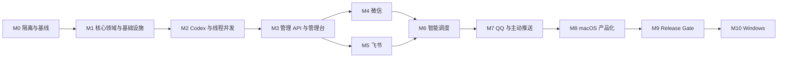

# qq-codex-bridge vNext 可执行开发计划

> 状态：待执行  
> 架构基线：`docs/PRODUCT-TECHNICAL-ARCHITECTURE-vNext.md`  
> 执行模式：单一主执行会话自主推进，按里程碑开发、验证和汇报  
> 兼容策略：不兼容 v0.x  
> 首发范围：macOS、微信、飞书、Codex AppServer、可选 AI Router

---

## 1. 计划目标

本计划用于把 vNext 目标架构转化为一套可以连续执行的工程任务。执行会话不再重复讨论整体方向，除非发现架构不变量互相冲突或需要新的外部授权。

最终交付必须实现：

1. 微信、飞书、QQ 的不同聊天空间可以稳定绑定不同 Codex 线程；
2. 不同 Codex 线程并行，同一线程严格串行；
3. 新聊天空间默认创建独立线程，不绑定最新线程；
4. 自定义 OpenAI-compatible AI 可以识别自然语言控制意图；
5. AI 只输出结构化决策，所有动作由确定性执行器校验和执行；
6. 管理台可以完成渠道、绑定、任务、Router、配置和诊断操作；
7. 配置使用 `config.json`，密钥使用 macOS Keychain，运行数据使用 SQLite；
8. macOS 使用 `launchd` 单用户自启动；
9. AppServer 为主链路，CDP 仅作受控 Recovery；
10. 全部 Release Gate 和自动化测试通过。

---

## 2. 执行授权与边界

### 2.1 执行会话可以自主完成

- 创建隔离分支和 worktree；
- 新增、修改和删除 vNext 分支中的代码、测试与文档；
- 安装实现目标所必需且经过评估的依赖；
- 运行类型检查、测试、构建、静态检查和本地服务；
- 创建新的 SQLite 测试数据库和临时目录；
- 按里程碑创建本地 Git Commit；
- 在不改变冻结产品决策的前提下处理普通实现细节；
- 修复执行过程中发现的、与当前里程碑直接相关的问题；
- 维护进度文档、ADR 和测试证据。

### 2.2 未经新的明确授权不能执行

- Push 到远程仓库；
- 创建或合并 Pull Request；
- 修改远程服务、线上渠道或生产配置；
- 删除原始脏工作区、用户分支、用户 Commit 或持久化数据；
- 使用真实联系人或群聊进行主动消息测试；
- 购买服务、申请账号、创建付费资源；
- 使用用户未提供的密钥；
- Apple 签名、Notarization 或正式发布；
- 把管理台开放到公网。

### 2.3 只有以下情况需要暂停并请求用户

- 微信需要用户扫码；
- 飞书、QQ 或 Router 需要真实凭据；
- 真实渠道测试会向外部人员或群聊发消息；
- Apple Developer 签名、Notarization 或发布凭据缺失；
- 需要不可逆删除用户数据；
- 冻结的产品决策之间出现无法同时满足的冲突；
- 同一阻塞条件已连续出现三轮且没有安全替代路径。

其他问题由执行会话自行决策、记录并继续。

---

## 3. 当前基线与工作区保护

### 3.1 当前事实

- 原始仓库存在大量未提交修改和未跟踪文件；
- 这些修改属于用户，不能覆盖、清理或纳入 vNext；
- vNext 架构文档当前位于原始工作区，尚未提交；
- vNext 不需要携带 v0.x 运行数据或兼容语义；
- 当前测试基线曾出现 9 个 AppServer 测试超时，初步指向 Fake WebSocket `open` 时序。

### 3.2 强制隔离策略

执行会话第一步必须：

1. 读取当前 `git status --short`；
2. 确认原始工作区路径；
3. 检查目标 sibling worktree 是否已经存在；
4. 从当前 `HEAD` 创建 `codex/vnext` 分支和独立 worktree；
5. 将三份 vNext 文档复制到新 worktree；
6. 后续所有业务改动只在新 worktree 中发生；
7. 原始工作区保持原样。

推荐目标路径：

```text
/Volumes/13759427003/AI/qq-codex-bridge-vnext
```

如果该路径已存在，不得覆盖；应检查其 Git 状态并选择新的明确路径。

### 3.3 基线提交

新 worktree 建立后，首先创建只包含以下文件的文档基线 Commit：

```text
docs/PRODUCT-TECHNICAL-ARCHITECTURE-vNext.md
docs/VNEXT-IMPLEMENTATION-PLAN.md
docs/VNEXT-NEW-SESSION-HANDOFF.md
docs/VNEXT-PROGRESS.md
```

不得把原始工作区的其他未提交修改复制或提交到 vNext。

---

## 4. 执行原则

### 4.1 架构优先级

发生冲突时按以下顺序处理：

```text
用户后续明确指令
→ 安全与不可逆风险
→ PRODUCT-TECHNICAL-ARCHITECTURE-vNext.md
→ 本实施计划
→ 项目 AGENTS.md
→ 当前 vNext 代码与测试
```

### 4.2 代码工作流

每项代码任务遵循：

```text
理解 → CodeGraph 定位 → 影响分析 → 小步实现
→ 精确测试 → 模块测试 → 全量检查 → 记录证据
```

要求：

- 修改任何现有 Symbol 前执行上游影响分析；
- HIGH/CRITICAL 风险必须先在进度更新中说明；
- 优先扩展现有可复用能力，不复制平行实现；
- 一个提交只解决一个明确工作包；
- 不为未来不确定需求新增配置或抽象；
- 测试失败不能通过跳过、放宽断言或延长任意超时掩盖；
- 每个里程碑结束运行变更影响检测和全量验证。

### 4.3 Definition of Done

单个任务完成必须同时满足：

- 实现符合目标架构；
- 相关 Unit/Contract/Integration 测试通过；
- 错误路径和边界条件有覆盖；
- 没有新的类型错误、Lint/Build 错误；
- 文档或 API Schema 已同步；
- `VNEXT-PROGRESS.md` 已记录实际验证；
- 无未解释的测试跳过、TODO 或静默 fallback。

---

## 5. 里程碑与依赖



| 里程碑 | 主要结果 | 复杂度 | 必须完成后才能进入 |
|---|---|---:|---|
| M0 | 隔离 worktree、文档和测试基线 | S | M1 |
| M1 | Domain、Ports、Config、Store、Fake Adapters | XL | M2 |
| M2 | AppServer、Binding、线程队列、CDP Recovery | XL | M3 |
| M3 | 管理 API、SSE、管理台核心页面 | XL | M4/M5 |
| M4 | 微信完整闭环 | XL | M6 |
| M5 | 飞书完整闭环 | L | M6 |
| M6 | AI Router 与自然语言控制 | XL | M7 |
| M7 | QQ、Push API、MCP | L | M8 |
| M8 | launchd、安装、诊断、清理 | L | M9 |
| M9 | 全量验收和发布候选 | XL | macOS 完成 |
| M10 | Windows Service 与 Credential Manager | XL | Windows 完成 |

复杂度只用于安排风险和检查强度，不代表固定工期。

---

## 6. M0：隔离、证据与执行基线

### M0-01 创建隔离 worktree

- 从原始仓库 `HEAD` 创建 `codex/vnext`；
- 复制三份 vNext 文档；
- 验证原始工作区状态没有变化；
- 记录新 worktree 的绝对路径和 Commit Hash。

验收：所有后续路径都指向新 worktree，原始脏工作区 diff 数量和内容未因本任务变化。

### M0-02 初始化进度台账

新增 `docs/VNEXT-PROGRESS.md`，包含：

```text
当前里程碑
已完成任务
正在执行任务
下一任务
测试证据
风险与阻塞
架构决策
最近更新时间
```

### M0-03 捕获工程基线

- Node、pnpm、macOS、Codex 版本；
- `pnpm check`；
- `pnpm test`；
- `pnpm build`；
- CodeGraph 状态；
- AppServer 可发现性；
- 当前测试失败清单。

不得为了“获得绿色基线”修改 v0.x 代码。基线失败只做记录。

### M0-04 建立 ADR 目录

新增：

```text
docs/decisions/vnext/
```

只在实现必须偏离架构文档或存在两个不可逆方案时写 ADR。

### M0 Gate

- [ ] 独立 worktree 可用；
- [ ] 三份文档和进度台账已进入 vNext 分支；
- [ ] 原始工作区未受影响；
- [ ] 工程基线已记录；
- [ ] 后续任务路径明确。

---

## 7. M1：核心领域与基础设施

### M1-01 建立 vNext 包结构

创建目标目录：

```text
apps/control-daemon
apps/admin-ui
apps/weixin-worker
apps/mcp-server-vnext
packages/domain
packages/application
packages/ports
packages/config
packages/store-sqlite
packages/codex-appserver
packages/codex-cdp-recovery
packages/channel-weixin
packages/channel-feishu
packages/channel-qq
packages/intent-openai-compatible
packages/observability
```

保留旧代码仅作阅读和选择性复用，不让新包依赖旧 App 层。

### M1-02 领域模型

实现并测试：

- `ChannelAccountId`；
- `ConversationSpace` / `spaceId`；
- `CodexThread`；
- `ThreadBinding`；
- `InboundEnvelope` / `MessageContent` / `Attachment`；
- `Turn` 状态机；
- `Delivery` 状态机；
- `ControlAction`；
- `RoutingDecision`；
- `ComponentHealth`；
- 稳定错误码。

关键测试：非法状态跳转、ID 规范化、独占 Binding 冲突、错误分类。

### M1-03 Ports

实现接口与契约测试工具：

- `ChannelPort`；
- `CodexPort`；
- `IntentRouterPort`；
- `SecretStorePort`；
- `ConfigStorePort`；
- `ServiceManagerPort`；
- 各 Repository Port；
- `Clock`、`IdGenerator`、`EventPublisher`。

### M1-04 配置系统

- 完整 Zod Schema；
- `config.json` 原子读写；
- Revision Hash；
- `ApplyPlanner`；
- Config Diff；
- Secret Reference；
- 测试用内存 Secret Store；
- macOS Keychain Adapter；
- 回滚流程。

不实现 `.env` 产品兼容层。

### M1-05 SQLite vNext

- 新数据库 `runtime-vnext.db`；
- WAL、Foreign Key、Busy Timeout；
- Schema Migration Runner；
- Conversation Space、Binding、Message、Turn、Decision、Delivery、Push、Runtime Event 表；
- Partial Unique Index 保证 Active/Exclusive Binding；
- 游标分页；
- Repository Contract Tests；
- 崩溃和事务回滚测试。

### M1-06 Application Use Cases

先使用 Fake Ports 实现：

- `ReceiveInboundMessage`；
- `BindConversationSpace`；
- `StartConversationTurn`；
- `ExecuteControlAction`；
- `ApplyConfiguration`；
- `RunHealthCheck`；
- `EnqueuePush`。

### M1-07 Fake 系统验收

构建三个 Fake Channel Space 和三个 Fake Codex Thread：

- A/B/C 独立绑定；
- 不同线程并行；
- 同一线程串行；
- 重启 Store 后 Binding 恢复；
- 独占冲突明确失败。

### M1 Gate

- [ ] Domain 无 Adapter/App 依赖；
- [ ] Ports 有可复用 Contract Suite；
- [ ] 配置、Keychain、SQLite 均有失败路径测试；
- [ ] Fake A/B/C 场景通过；
- [ ] `check/test/build` 全绿。

---

## 8. M2：Codex、Binding 与并发

### M2-01 重建 Fake AppServer

- 监听器注册后异步触发 `open`；
- 模拟 Request/Response、Notification、乱序、重复、断线和超时；
- 支持 Thread Start/List/Rename/Fork；
- 支持 Turn Start/Delta/Complete/Interrupt；
- 禁止测试依赖同步事件。

### M2-02 AppServer Adapter

- 连接发现和受管启动；
- JSON-RPC Request Map；
- Pending Turn Map；
- Thread/Turn ID 路由；
- 增量和最终回复归一化；
- 媒体引用；
- Reconnect；
- Dispose 时清理所有 Pending Promise；
- Capability 和 Health。

### M2-03 Thread Coordinator

- 新 Space 自动创建独立 Thread；
- Active Binding 查询；
- 独占与共享 Binding；
- 切换、新建、重命名、分叉、解绑；
- Binding 冲突和 Thread Not Found 恢复；
- 缓存标题只用于展示，真实 ID 始终来自 AppServer。

### M2-04 调度器

- 每个 Thread FIFO Queue；
- 全局 Semaphore，默认并发 3；
- 每个 Space 入站顺序号；
- Thread 队列和全局队列上限；
- 排队状态事件；
- 中断和取消；
- Daemon 重启后的 Unknown Turn 对账。

### M2-05 CDP Recovery

- 单独 Capability Set；
- 仅实现选择线程、提交文本、采集最终回复和基本状态；
- 全局互斥；
- 仅在 AppServer 尚未确认提交时进入；
- 提交后断线绝不自动重发；
- 管理台和 IM 状态明确标记 `degraded`。

### M2-06 真实 Codex Smoke Test

在不修改用户数据的前提下验证：

- 列出线程；
- 创建三个专用测试线程；
- 并行提交可识别的测试 Prompt；
- 正确回收每个 Turn；
- 中断测试 Turn；
- 测试完成后保留或显式列出测试线程，不自动删除。

### M2 Gate

- [ ] Fake AppServer 全部时序场景通过；
- [ ] A/B/C Thread 并行，回复不串线；
- [ ] 同 Thread 严格 FIFO；
- [ ] 提交后断线无重复提交；
- [ ] Recovery 限制被测试锁定；
- [ ] 真实 Codex Smoke Test 通过或明确记录外部阻塞。

---

## 9. M3：管理 API 与管理台

### M3-01 Control Daemon Composition Root

- 只负责装配和生命周期；
- Use Case 不内联在 Bootstrap；
- 组件启动、停止和优雅退出；
- 配置 Apply 和组件重启；
- 统一 Health Registry；
- Structured Event Bus。

### M3-02 管理 API

实现架构文档规定的 `/api/v1`：

- System/Health；
- Channels；
- Spaces/Messages/Bindings；
- Threads/Turns；
- Router；
- Config Plan/Apply；
- Diagnostics；
- Push Targets。

要求：Zod 输入校验、稳定错误响应、Loopback 限制、CSRF 和本地 Session。

### M3-03 SSE

发布：

- Component Health；
- Turn Queue/Running/Complete；
- Binding 变化；
- Config Apply；
- Router 熔断；
- Transport 切换。

支持断线重连和 Last-Event-ID。

### M3-04 Admin UI 基础

技术选择：Vite + React + TypeScript，客户端应用，由 Daemon 静态托管。

约束：

- 沿用当前管理台的克制、本地工具型视觉语言；
- 不进行营销化视觉重设计；
- 原生语义控件优先；
- 不引入重量级全栈框架；
- API Client 和 SSE 状态集中管理；
- 页面级错误边界和加载/空状态完整。

### M3-05 六个页面

1. 首页：四态健康和快速操作；
2. 渠道：账号、授权、测试、启停；
3. 对话空间：线程绑定、消息、共享警告；
4. 任务：排队、运行、停止、失败；
5. 智能调度：配置、测试和决策记录；
6. 设置与诊断：配置应用、日志、数据清理和诊断包。

### M3-06 可访问性和响应式

- 键盘完成全部核心路径；
- `aria-live`；
- Focus Management；
- 200% Zoom；
- 窄屏单列；
- Secret 遮蔽；
- 不以颜色作为唯一状态表达。

### M3 Gate

- [ ] API Contract Tests 全绿；
- [ ] 六个页面可操作，不是静态占位；
- [ ] Config Apply 能证明 Active Revision；
- [ ] Binding 操作可视化完成；
- [ ] SSE 断线重连正确；
- [ ] 键盘和基础无障碍检查通过。

---

## 10. M4：微信优先链路

### M4-01 Worker IPC

- Daemon 启停和监督 Worker；
- 本地鉴权；
- 心跳和版本协商；
- Worker 崩溃退避重启；
- 状态进入 Health Registry。

### M4-02 登录体验

- 管理台生成和展示二维码；
- 已扫描、待确认、已登录、过期、失效状态；
- 强制重新登录；
- 登录状态持久化但不泄露敏感内容；
- 用户可从管理台注销。

### M4-03 微信消息

优先顺序：

1. 文本入站/出站；
2. 图片入站下载和出站；
3. 文件入站/出站；
4. 语音入站、转写和出站；
5. 视频入站/出站；
6. 长文本分段和格式降级。

### M4-04 韧性

- 断线重连；
- 重复事件去重；
- 登录失效明确提示；
- 限流与退避；
- 单个媒体失败不吞掉正文；
- Worker 故障不影响飞书和 Codex。

### M4-05 真实账号 Gate

需要用户扫码后执行专用测试 Space：

- 连续双向文本；
- 图片、文件、语音；
- Thread Binding；
- Daemon 和 Worker 重启恢复；
- 24 小时连续运行。

### M4 Gate

- [ ] Fake Contract 全绿；
- [ ] 二维码和状态闭环完整；
- [ ] 文本、图片、文件、语音闭环；
- [ ] 单渠道故障隔离；
- [ ] 真实账号 Gate 完成或记录为唯一外部阻塞。

---

## 11. M5：飞书优先链路

### M5-01 应用配置与权限自检

- App ID/Secret 写入 Keychain；
- 长连接能力检查；
- 必要事件和消息权限检查；
- Bot 可见范围提示；
- 一键发送自检到已验证 Space。

### M5-02 飞书消息

- Text/Post 入站；
- Text/Rich Text 出站；
- 图片和文件入站/出站；
- 音频按平台能力处理；
- 群聊 @策略；
- 私聊与群聊 Space ID 稳定。

### M5-03 韧性和限额

- 长连接断线；
- Token 刷新；
- 429 分类和退避；
- Bot 自己的消息不回环；
- 事件重复投递去重；
- Provider Error 转稳定错误码。

### M5-04 真实租户 Gate

- 权限自检；
- 文本、图片和文件闭环；
- 私聊与群聊各一条测试；
- 重连；
- 24 小时连续运行。

### M5 Gate

- [ ] Contract 和 Integration 全绿；
- [ ] 权限缺失能给出准确修复动作；
- [ ] 私聊/群聊 Binding 隔离；
- [ ] 飞书失败不影响微信；
- [ ] 真实租户 Gate 完成或记录为外部阻塞。

---

## 12. M6：AI Router 与自然语言控制

### M6-01 统一 Action Executor

- 显式命令 Parser 和 AI Router 只产出 `ControlAction`；
- 真实 Thread ID 由服务端解析；
- 风险等级和授权集中判断；
- 所有执行结果使用稳定结构；
- 斜杠命令优先且不调用 AI。

### M6-02 OpenAI-compatible Adapter

- Base URL、Model、Secret；
- JSON Schema/Structured Output；
- Zod 二次校验；
- 1500ms 总超时；
- 输出大小限制；
- 安全重定向策略；
- 三次失败熔断 60 秒；
- Health/Test Connection。

### M6-03 Router Context Builder

只发送：当前消息、Space 展示名、当前线程标题、最多十条候选线程、最多三条控制上下文和动作清单。

测试必须证明不会发送 Token、原始 Provider ID、完整历史或本地文件。

### M6-04 `off / assist / auto`

- `off` 不发外部请求；
- `assist` 变更动作确认；
- `auto` 高置信度中低风险动作自动；
- 高风险动作永远确认；
- 低置信度返回澄清；
- 控制语义失败不能静默成为 Chat。

### M6-05 确认状态机

```text
pending → confirmed → executing → completed
        → cancelled
        → expired
```

- 确认有效期 2 分钟；
- 纯文本渠道支持“1 确认 / 2 取消”；
- 支持交互卡片的渠道可以提供按钮；
- 确认必须绑定原 Space、原用户和 Decision ID；
- 新控制请求可以取消旧 Pending Confirmation。

### M6-06 决策审计与测试台

- Router Decision 元数据；
- 置信度、耗时、确认和结果；
- 默认不保存完整明文；
- 管理台内置测试语句；
- 覆盖聊天、列表、切换、新建、重命名、停止、模型、额度、推送和歧义。

### M6-07 质量集

建立可重复离线数据集：

- 至少 200 条中文自然语言；
- 40% 普通聊天；
- 40% 明确控制；
- 20% 歧义、否定、反问和诱导；
- 高风险误自动执行必须为 0；
- 普通聊天错误拦截率和控制识别率均记录。

### M6 Gate

- [ ] 显式命令和 AI 共用 Executor；
- [ ] AI 无直接 Port 权限；
- [ ] Router 断线不影响 Chat/命令；
- [ ] 高风险无法绕过确认；
- [ ] 隐私测试通过；
- [ ] 离线质量集达到架构指标。

---

## 13. M7：QQ、Push API 与 MCP

### M7-01 QQ 对话

- 文本、图片、语音和文件按账号能力实现；
- 私聊和群聊 Space；
- @和权限策略；
- Gateway Session 恢复；
- Provider 限流和 Markdown 能力降级。

QQ 主动推送只有在账号能力自检通过时启用，否则明确显示不支持。

### M7-02 Push Target

- 只能从已验证 Space 创建；
- Agent 只看到 Alias；
- 真实 Provider ID 不对 MCP 暴露；
- 支持启用、停用和测试；
- 目标变更写入审计事件。

### M7-03 Push Queue

- 幂等；
- `queued/sending/retry_wait/delivered/failed`；
- Lease 和崩溃恢复；
- 临时/永久失败分类；
- 独立并发和限流；
- 媒体 Outbox Sandbox。

### M7-04 MCP

- stdio；
- 复用 loopback Push API；
- `push_message`、`push_task_report`、`list_push_targets`、`get_push_status`；
- stdout 只输出协议；
- Secret 不进入命令参数或日志。

### M7 Gate

- [ ] QQ 对话不影响微信/飞书；
- [ ] 不支持主动推送时明确失败；
- [ ] Push 幂等和恢复测试通过；
- [ ] MCP Contract 和安全测试通过。

---

## 14. M8：macOS 产品化

### M8-01 launchd

- 用户级 LaunchAgent；
- 自动启动；
- 崩溃退避；
- 优雅重启；
- 日志路径；
- 安装、状态、卸载命令；
- 卸载默认保留数据。

### M8-02 首次设置

管理台引导：

```text
系统检查 → Codex → 微信/飞书 → 测试消息
→ 独立线程 → Router 可选配置 → 完成
```

完成状态必须基于真实四段闭环，不使用纯配置判断。

### M8-03 诊断和数据管理

- 脱敏诊断包；
- Runtime Event；
- 消息和媒体清理；
- 保留策略 Worker；
- 数据目录大小；
- 清除内容但保留 Binding；
- 配置 Revision 回滚。

### M8-04 构建和安装

- 可重复构建；
- 版本注入；
- 安装产物清单；
- 未签名开发包；
- 签名/Notarization 作为需要用户凭据的单独 Gate。

### M8 Gate

- [ ] 登录后自动启动；
- [ ] 用户不需要手动启动多个命令；
- [ ] 管理台可重启组件；
- [ ] 诊断包不含 Secret/正文；
- [ ] 安装卸载可重复；
- [ ] 用户数据不会被默认删除。

---

## 15. M9：macOS Release Gate

### M9-01 全量自动化验证

必须执行并记录：

```text
类型检查
单元测试
Port Contract Tests
集成测试
Fake AppServer 故障矩阵
Admin UI 测试与构建
安全测试
安装/卸载测试
全量 E2E
```

### M9-02 性能与韧性

- 入站确认 P95；
- Router P95；
- Control Action P95；
- 三线程并行；
- Thread 队列背压；
- AppServer 断线；
- Worker 崩溃；
- Daemon 重启；
- SQLite 恢复；
- 24 小时微信和飞书连续运行。

### M9-03 安全检查

- Keychain；
- Loopback；
- CSRF；
- Router URL/Redirect；
- 日志脱敏；
- 媒体路径逃逸；
- Push Target 枚举；
- Confirmation 绑定；
- 诊断包泄密。

### M9-04 Release Checklist

逐项确认架构文档第 22.2 节十个 Release Gate。任何一项失败都不能宣称 macOS vNext 完成。

### M9 Gate

- [ ] 所有自动化测试全绿；
- [ ] 真实微信和飞书 Gate 完成；
- [ ] 所有性能和安全目标达成或得到用户明确豁免；
- [ ] 无 P0/P1 未解决问题；
- [ ] 文档、安装和诊断完整；
- [ ] 形成最终验收报告。

---

## 16. M10：Windows

Windows 在 macOS Release Gate 后开始，不与 macOS 首版并行扩大范围。

任务：

- `ServiceManagerPort` 的 Windows Service 实现；
- `SecretStorePort` 的 Credential Manager 实现；
- Windows 数据目录；
- Codex 进程和 AppServer 发现；
- CDP Recovery 的 Windows 键盘差异；
- 安装包和卸载；
- 防火墙和 Loopback；
- 完整跨平台 Contract/E2E。

M10 Gate：同一业务 Test Suite 在 macOS 和 Windows 均通过，平台差异只存在于 Adapter。

---

## 17. 测试矩阵

| 范围 | Unit | Contract | Integration | Real E2E |
|---|---:|---:|---:|---:|
| Domain/State Machine | 必须 | — | — | — |
| Config/Keychain | 必须 | 必须 | 必须 | macOS 必须 |
| SQLite | 必须 | 必须 | 必须 | — |
| AppServer | 必须 | 必须 | 必须 | Codex Smoke |
| CDP Recovery | 必须 | 必须 | 必须 | macOS Smoke |
| Thread Coordinator | 必须 | — | 必须 | 三线程 |
| Admin API | 必须 | 必须 | 必须 | Browser Flow |
| 微信 | 必须 | 必须 | Fake Worker | 真实账号 |
| 飞书 | 必须 | 必须 | Fake SDK | 真实租户 |
| QQ | 必须 | 必须 | Fake Gateway | 测试 Bot |
| Router | 必须 | 必须 | Fake HTTP | 用户 Endpoint |
| Push/MCP | 必须 | 必须 | 必须 | 已验证目标 |
| launchd | 必须 | — | 必须 | 真实登录重启 |

### 17.1 测试执行顺序

每次任务：

1. 当前 Symbol/模块精确测试；
2. 当前 Package 测试；
3. 相关 Contract/Integration；
4. `pnpm check`；
5. `pnpm build`；
6. 里程碑结束运行全量测试。

### 17.2 禁止做法

- `test.skip` 掩盖失败；
- 任意扩大超时以躲避死锁；
- Mock 掉本应验证的边界；
- 只验证成功路径；
- 把实际未运行的真实渠道测试写成通过；
- 因测试困难改变产品不变量。

---

## 18. 进度汇报制度

### 18.1 用户可见更新

执行会话在以下时点更新：

- 开始新里程碑；
- 完成一个有用户价值的工作包；
- 发现 HIGH/CRITICAL 影响范围；
- 测试失败且需要调整实现；
- 需要真实凭据、扫码或外部授权；
- 里程碑 Gate 完成；
- 最终验收。

持续工具工作期间不让用户超过 60 秒看不到进度。

### 18.2 `VNEXT-PROGRESS.md` 格式

```md
# vNext Progress

## Snapshot
- Updated:
- Branch / Worktree:
- Current milestone:
- Overall status: on_track | at_risk | blocked

## Completed
- [x] Task ID — result — commit

## In Progress
- [ ] Task ID — current substep

## Next
- [ ] Task ID

## Verification
| Command / Check | Result | Date |

## Risks and Blockers
| ID | Impact | Mitigation | Owner |

## Decisions
| ADR / Decision | Reason |
```

### 18.3 里程碑报告

每个 Gate 报告：

- 实际完成内容；
- 改动范围；
- 测试结果；
- 未通过项；
- 架构偏差；
- 风险变化；
- 下一里程碑。

不使用“基本完成”“应该可以”等不可验证表述。

---

## 19. 风险登记

| 风险 | 概率 | 影响 | 应对 |
|---|---:|---:|---|
| Codex AppServer 内部协议变化 | 中 | 高 | Contract、Capability、CDP Recovery、版本诊断 |
| 微信协议或登录态不稳定 | 高 | 高 | 独立 Worker、重连、自检、真实 24h Gate |
| 飞书权限配置复杂 | 中 | 中 | 权限自检和精确修复说明 |
| Router 增加延迟 | 中 | 中 | 1500ms 超时、熔断、off/assist、显式命令直通 |
| Router 误执行 | 低 | 极高 | 白名单 Action、Schema、风险确认、审计 |
| 同线程并发冲突 | 中 | 高 | Thread Queue、数据库不变量、并发测试 |
| 消息重复提交 | 中 | 极高 | 提交确认边界、幂等账本、禁止提交后 fallback |
| Secret 泄露 | 低 | 极高 | Keychain、Redaction、安全测试 |
| 原始脏工作区被覆盖 | 中 | 极高 | 强制独立 worktree，不写原目录 |
| 管理台范围膨胀 | 中 | 中 | 六页固定 IA，不做企业能力 |
| macOS 发布凭据缺失 | 高 | 中 | 先产出未签名开发包，签名作为外部 Gate |

---

## 20. 自主决策规则

执行会话可以自行决定：

- 文件名和内部 Symbol 名；
- 小型工具库选择；
- 测试组织方式；
- 不影响 API 的实现细节；
- 同一冻结架构内的简单 UX 文案；
- 修复当前任务直接暴露的缺陷。

必须写 ADR 后再决定：

- 更换数据库或前端框架；
- 改变进程边界；
- 改变配置、密钥或 Binding 的唯一真相源；
- 放宽高风险确认；
- 改变 AppServer/CDP 边界；
- 新增云端依赖；
- 偏离微信、飞书优先级；
- 改变用户数据保留默认值。

必须请求用户：

- 改变已冻结的产品目标；
- 需要外部账号、扫码、签名或发布；
- 需要破坏性处理原始工作区或用户数据。

---

## 21. 最终交付物

macOS vNext 完成时必须交付：

- 可构建源码；
- 可重复测试套件；
- 未签名开发安装包或明确的构建产物；
- launchd 安装/卸载；
- 本地管理台；
- 微信、飞书、QQ Adapter；
- AI Router；
- Push API/MCP；
- 配置、Keychain、SQLite；
- 诊断包；
- 用户安装和使用说明；
- 架构、API、数据库和安全文档；
- 进度台账与 ADR；
- 最终验收报告；
- 明确列出的外部凭据/签名未完成项。

完成标准不是“代码写完”，而是架构文档的 Release Gate 有逐项证据。
