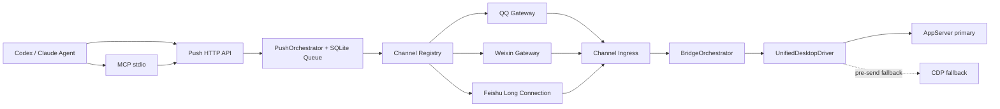

# Architecture

v0.2 将用户对话与 Agent 主动推送拆为两条独立链路，共享渠道适配器和 SQLite 基础设施，但不复用依赖入站消息 ID 的 `ChatEgressPort`。

## Desktop Transport

`UnifiedDesktopDriver` 保持 `DesktopDriverPort` 契约，并通过独立的 `DesktopTransportStatusPort` 暴露只读状态。`auto` 模式优先 AppServer；只有 `turn/start` 尚未确认时才允许降级到 CDP。已确认后发生故障不会自动跨传输重发，避免重复消息。周期探测恢复后只影响下一轮。

CDP 的 DOM 选择器由 `selectors/v26.json`、`selectors/v27.json` 和严格校验的自定义文件提供。本地 rollout/log 数据库按版本号降序发现，并验证所需表列；高版本损坏或不兼容时回退到较低兼容版本。

## Push Pipeline

`POST /api/v1/push` 只接受目标别名与稳定幂等键，成功统一返回 `202 queued`。`push_jobs` 状态按 `queued -> sending -> delivered` 推进，临时失败进入 `retry_wait`，最多三次后进入 `failed`。进程启动时恢复待处理任务和超时的 `sending` 任务。

MCP Server 使用 `StdioServerTransport`，仅把四个工具映射到同一 loopback Push API，不建立第二套队列或鉴权模型。目标解析、渠道能力判断和媒体安全检查仍在服务端完成。

## Compatibility

`packages/adapters/chatgpt-desktop` 与旧 CLI 在 v0.2 仅作兼容保留，不参与默认装配。`conversation_provider` 数据列和 `chatgpt-desktop` 存量值保留到 v0.3，以便无损迁移和必要回滚。
